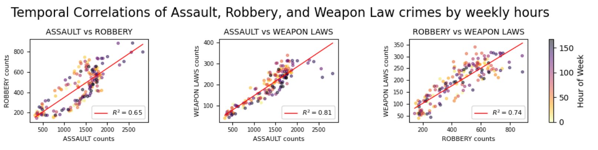

---
# Feel free to add content and custom Front Matter to this file.
# To modify the layout, see https://jekyllrb.com/docs/themes/#overriding-theme-defaults

layout: home
title: 'Assignment 2: The San Fransisco crime crawl – Where Data Meets Drama!'
---

# Suspect: The Dataset
In this one-pager, we explore distinct temporal patterns in crimes across San Francisco — focusing on Robbery, Assault, and Weapon Law crimes. What if the timing of these crimes could tell us more than the crimes themselves?
To support this exploration, the dataset used in this analysis consists of reported crime incidents in San Fransisco from 2003 till present and is sourced from the [San Fransisco Police Department Incident Reports](https://data.sfgov.org/browse?category=Public+Safety&sortBy=relevance&page=1&pageSize=20). The data was accessed on June 2, 2025, which serves as the cutoff date. To ensure consistency and complete annual coverage, we focus exclusively on data from 2003 to 2024.  

# Are These Crimes Partners in Crime?

The figure below presents three scatter plots showing the temporal relationships between Robbery, Assault, and Weapon Law crimes over the 168 hours of a standard week (7 days × 24 hours). Each point represents one hour during the week (for example, hour 150 is Sunday morning at 6 AM, shown as dark purple gradient). Therefore, each panel contains 168 scatterpoints, where the placement of the scatterpoint is determined by the count of crime 1 (x-axis) and the count of crime 2 (y-axis) during that hour. This provides a visual comparison of how these crime types vary and potentially align over the hours of the week.
<!-- Calendar Figure -->

  
  

    Figure  1: The subplots show fairly correlated data between the crime categories Robbery, Assault and Weapon Law. Each scatterpoint represents an hour during the week (0-168) with a total of 168 scatterpoints in each subplot.
  

The fairly strong positive correlations suggest these crimes often co-occur, potentially driven by shared social or environmental circumstances. The displayed R&sup2; values indicates positive correlation, meaning that when one type of crime increases, the second tends to increase too, and vice versa. Notably, crime intensity builds toward the weekend, indicating more incidents of assault, robbery and weapon law related crimes reported as the city’s tempo rises.

This visualization supports the assumption that the three crime categories are sufficiently correlated to be treated as a single combined category. However, even on weekends, there are quieter moments — likely in the early mornings — though these are harder to spot due to the limits of the color gradient. In the next visualization, we’ll use this grouping to further uncover how crime pulses through the rhythm of the week.

# When Does the City Get Sketchy?
Crime doesn’t sleep, and it definitely has a schedule. By plotting the frequency of Robbery, Assault, and Weapon Law crimes across all 168 hours in a week, we uncover timeframes where you could be more likely to run into trouble. In the interactive figure below, you can explore specific time slots, revealing when crimes happen most often. 

  <iframe src="my_bokeh_plot.html" width="100%" height="320" frameborder="0"></iframe>
  

    Figure 2: The most likely times of the day throughout the week to run into trouble in San Francisco, based on event data from SF police department from 2003 to 2024. Further, one can interactively choose specific time intervals. Note: Each bar (representing a weekday) sums to a proportion of 1, meaning the figure displays the hourly distribution of crimes for each day of the week. This implies that the values represent the relative frequency of crimes per time interval, not the total number of crimes per day
  

 
Late-night hours, especially from Friday evening through early Sunday morning, we see a noticeable spike in these violent crimes. This pattern points to a strong link between nightlife activity and criminal behavior. So be extra careful when going out in town during the weekend when the streets can get dangerous. However, in what district should you keep an extra eye? This will be explored further in the next plot. 

# Which SF District Turns Into a Crime Scene After Dark?
So do you want to stay safe from crimes and potentially getting your wallet robbed in San Fransisco? Best to stay at home! No don't worry, we have constructed a dynamic heatmap throughout the years (2003-2024) that shows where most of the reported incidents for these crimetypes occur in San Fransisco. Due to the insights from the previous visualization, the heatmap only considers weekend nights (Friday and Saturday) between 8 PM and 4 AM. 
<!-- Interactive Crime Map Figure -->

  <iframe src="crime_map_weekend.html" width="100%" height="615" frameborder="0" style="border: 1px solid #ccc; border-radius: 8px;"></iframe>
  

    Figure 3: Distribution of aggregated Assault, Robbery, and Weapon law incidents occurring on Friday and Saturday nights (8 PM - 4 AM) in San Francisco, based on reported data from 2003 to 2024.
  

So what does the heatmap show us? If you are willing to take the risk, the vibrant districts Mission and Southern is home to [dense nightlife and vibrant bars](https://sanfranciscodrinksguide.com/en/blog/where-to-drink-93/bars-98/bar-hopping-in-the-mission-district-90.htm). However, also home to the consistently highest counts of assaults, robberies and weapon law crimes throughout the years. Meanwhile, Richmond and Sunset districts sleep soundly under a blanket of low crime, their suburban calm rarely disturbed and known for a [family friendly environment](https://thecityguards.com/safest-neighborhoods-in-san-francisco-your-guide-to-secure-living/).

# Crime-clusion
Our crime crawl through San Francisco uncovers a city where criminal activity peaks during prime nightlife hours. Robbery, Assault, and Weapon Law incidents aren’t just happening — they’re happening together, and they’re happening on a schedule. Late-night weekend hours, especially from Friday evening into early Sunday morning, emerge as a prime time for trouble, aligning with the city’s nightlife rhythm. 
The correlation between these crime types suggests they share more than just the streets — they share timing and perhaps even causes, making it reasonable to analyze them as a collective group. And when it comes to location, the Mission and Southern districts steal the spotlight, consistently showing higher arrest reports.
So, if you're planning a late-night stroll through San Francisco, you might want to keep an eye on the clock — and maybe steer clear of certain neighborhoods once the weekend lights go down. 

## References & Sources
[San Fransisco Police Department Incident Reports](https://data.sfgov.org/browse?category=Public+Safety&sortBy=relevance&page=1&pageSize=20). Accessed 29th of March 2025

[San Fransisco Night Life](https://sanfranciscodrinksguide.com/en/blog/where-to-drink-93/bars-98/bar-hopping-in-the-mission-district-90.htm). Accessed 31st of March 2025

[Safest Neighborhoods in San Fransisco](https://thecityguards.com/safest-neighborhoods-in-san-francisco-your-guide-to-secure-living/). Accessed 31st of March 2025

## Contribution
Every member contributed equally.

