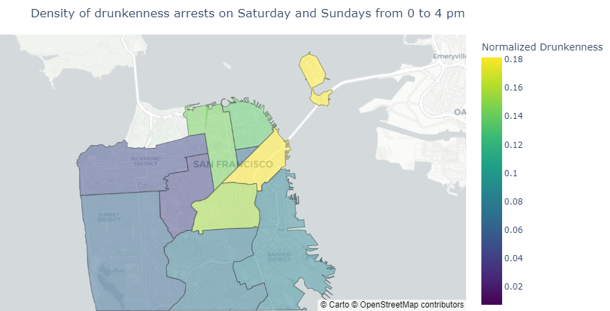

---
# Feel free to add content and custom Front Matter to this file.
# To modify the layout, see https://jekyllrb.com/docs/themes/#overriding-theme-defaults

layout: home
title: 'Assignment 2: 
title: The San Fransisco crime crawl – Where Data Meets Drama!'
---

# Data Description:
In this one-pager, we explore distinct temporal patterns in crimes across San Francisco — focusing on Robbery, Assault, and Weapon Law crimes. What if the timing of these crimes could tell us more than the crimes themselves?
To support this exploration, the dataset used in this analysis consists of reported crime incidents in San Fransisco from 2003 till present and is sourced from the [San Fransisco Police Department Incident Reports](https://data.sfgov.org/browse?category=Public+Safety&sortBy=relevance&page=1&pageSize=20). The data was accessed on June 2, 2025, which serves as the cutoff date. To ensure consistency and complete annual coverage, we focus exclusively on data from 2003 to 2024.  

# Are These Crimes Partners in Crime?

The figure below presents three scatter plots showing the temporal relationships between Robbery, Assault, and Weapon Law crimes over the 168 hours of a standard week (7 days × 24 hours). Each point represents the number of reported incidents during a specific hour ($crime_1$, $crime_2$), providing a visual comparison of how these crime types vary and potentially align over the hours of the week. A colorbar 
<!-- Calendar Figure -->

  
  

    Figure 2: The subplots show highly correlated data. Each data set are temporal .
  

There is a strong correlation between all the selected crime types. The R&sup2; values indicates positive correlation, meaning  

supporting the assumption that they can be reasonably combined into a single category. 

# When Does the City Get Sketchy?

  <iframe src="my_bokeh_plot.html" width="150%" height="420" frameborder="0"></iframe>
  

    Figure 1: The most likely times of the day throughout the week to find your drunk friend in San Francisco based on aggregated event data. Further, one can interactivelt choose specific time intervals.
  

# Which SF District Turns Into a Crime Scene After Dark?
<!-- Crime Map Figure -->

  
  

    Figure 3: Distribution of normalized assault, robbery, and weapon law incidents occurring on friday and saturday nights in San Francisco, based on reported data from 2003 to 2024.
  

We notice on the map of the crime data distribution that most of the reported arrests for our focused crime types happens in the Mission district.

